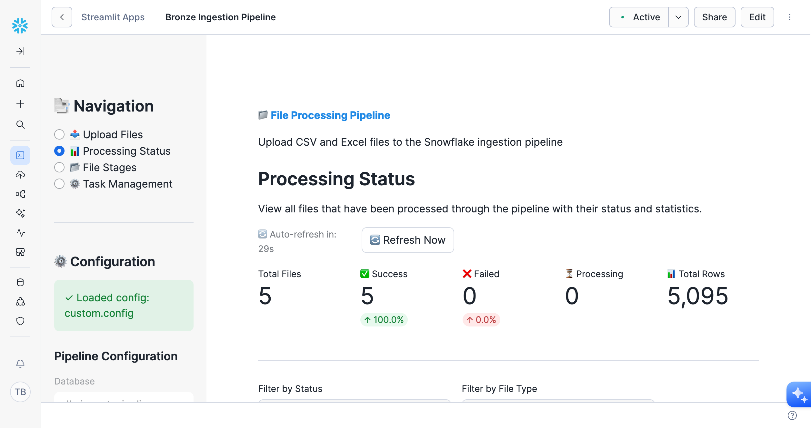
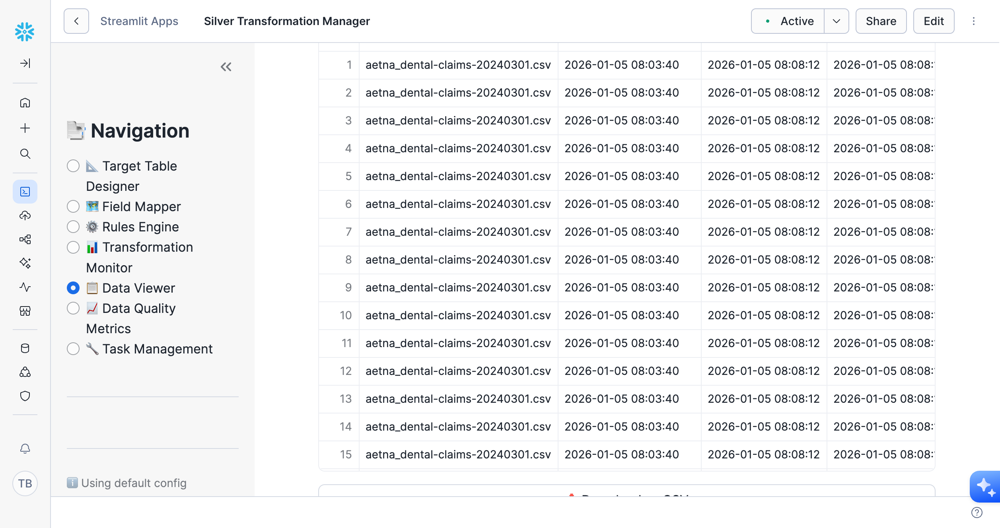
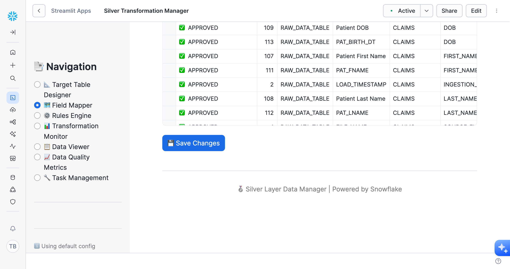

# Complete User Guide - Snowflake File Processing Pipeline

## 📖 Table of Contents

1. [Introduction](#introduction)
2. [Getting Started](#getting-started)
3. [Bronze Layer - File Ingestion](#bronze-layer---file-ingestion)
4. [Silver Layer - Data Transformation](#silver-layer---data-transformation)
5. [End-to-End Workflow](#end-to-end-workflow)
6. [Best Practices](#best-practices)
7. [Troubleshooting](#troubleshooting)

---

## Introduction

The Snowflake File Processing Pipeline is a complete data ingestion and transformation solution built entirely on Snowflake native features. It provides:

- **Bronze Layer**: Automated file discovery, processing, and archival
- **Silver Layer**: Intelligent data transformation with ML/LLM field mapping
- **Modern UI**: Streamlit applications for monitoring and management
- **Zero Infrastructure**: Serverless architecture with no external dependencies

### Architecture Overview

```
┌─────────────────────────────────────────────────────────────┐
│                    BRONZE LAYER (Raw Ingestion)              │
│  ┌──────────┐    ┌──────────┐    ┌──────────┐              │
│  │ CSV/Excel│ -> │ Discovery│ -> │Processing│ -> RAW_DATA   │
│  │  Files   │    │   Task   │    │   Task   │    TABLE     │
│  └──────────┘    └──────────┘    └──────────┘              │
└─────────────────────────────────────────────────────────────┘
                            ↓
┌─────────────────────────────────────────────────────────────┐
│              SILVER LAYER (Transformation & Quality)         │
│  ┌──────────┐    ┌──────────┐    ┌──────────┐              │
│  │  Field   │ -> │  Rules   │ -> │Transform │ -> Target    │
│  │ Mapping  │    │  Engine  │    │   Task   │    Tables    │
│  └──────────┘    └──────────┘    └──────────┘              │
└─────────────────────────────────────────────────────────────┘
```

---

## Getting Started

### Prerequisites

- Snowflake account with `SYSADMIN` and `SECURITYADMIN` roles
- Snowflake CLI installed and configured
- Access to a warehouse (default: `COMPUTE_WH`)

### Quick Deployment

```bash
# Deploy complete solution (Bronze + Silver)
./deploy.sh

# Or deploy individually
./deploy_bronze.sh  # Bronze layer only
./deploy_silver.sh  # Silver layer only
```

The deployment takes 5-12 minutes and creates:
- Database: `DB_INGEST_PIPELINE`
- Schemas: `BRONZE`, `SILVER`, `PUBLIC`
- Stages, tables, procedures, tasks, and Streamlit apps

### Accessing the Applications

After deployment, access the Streamlit applications:

1. **Bronze Ingestion Pipeline**: 
   - Snowsight → Streamlit → `BRONZE_INGESTION_PIPELINE`
   - URL: `https://<account>.snowflakecomputing.com/streamlit/DB_INGEST_PIPELINE/PUBLIC/BRONZE_INGESTION_PIPELINE`

2. **Silver Transformation Manager**:
   - Snowsight → Streamlit → `SILVER_TRANSFORMATION_MANAGER`
   - URL: `https://<account>.snowflakecomputing.com/streamlit/DB_INGEST_PIPELINE/PUBLIC/SILVER_TRANSFORMATION_MANAGER`

---

## Bronze Layer - File Ingestion

The Bronze layer handles raw file ingestion from CSV and Excel files into Snowflake.

### Architecture Workflow


*Bronze layer automated pipeline with 5 tasks: discovery, processing, file movement, and archival*

### Features

- ✅ Automated file discovery every 60 minutes (configurable)
- ✅ Support for CSV and Excel (.xlsx, .xls) formats
- ✅ Queue-based processing with status tracking
- ✅ Error handling and quarantine
- ✅ Automatic file archival (30-day retention)
- ✅ Real-time monitoring via Streamlit

### Bronze Streamlit Application


*Real-time monitoring dashboard showing file processing status, success rates, and detailed metrics*

#### Global TPA Selector

**NEW: TPA Selection in Header**
- **Location**: Top-left of the application header
- **Label**: "TPA:" dropdown
- **Persistence**: Selection applies to all pages
- **Dynamic**: Loads TPAs from `BRONZE.TPA_MASTER` table

**How to Use:**
1. Open Bronze Streamlit app
2. Select TPA from dropdown in header (e.g., "Provider A Healthcare")
3. All pages automatically filter by selected TPA
4. Selection persists as you navigate between pages

#### 1. Upload Files

Upload CSV or Excel files directly through the web interface:

**TPA Context**
- Files are automatically tagged with the TPA selected in the header
- No need to select TPA again on the upload page
- Info message shows which TPA will be used for uploads
- Files are uploaded to `@SRC/{tpa_name}/` stage subfolder

**Upload Steps**
- Drag and drop files or click to browse
- Multiple file upload supported
- Files automatically tagged with selected TPA
- Automatic discovery triggers on schedule or manual execution

**Example Folder Structure:**
```
@SRC/
├── provider_a/
│   ├── dental-claims-20240301.csv
│   └── medical-claims-20240315.csv
├── provider_b/
│   └── claims-20240115.csv
└── provider_c/
    └── medical-claims-20240215.xlsx
```


*Drag-and-drop file upload interface with "Process Files" checkbox for immediate processing*

#### 2. Processing Status

Monitor file processing in real-time for the selected TPA:

- **Total Files**: Count of all processed files for selected TPA
- **Success Rate**: Percentage of successfully processed files for selected TPA
- **Failed Files**: Files that encountered errors for selected TPA
- **Total Rows**: Cumulative rows ingested for selected TPA

**TPA Filtering:**
- All statistics and file lists filtered by selected TPA
- Only shows files belonging to the selected TPA
- Filters include: Status and File Type (TPA filter removed from page)

**Status Values:**
- ✅ `SUCCESS`: File processed successfully
- ❌ `FAILED`: File processing failed (see error message)
- ⏳ `PROCESSING`: Currently being processed
- 📝 `PENDING`: Queued for processing

#### 3. File Stages

View files across all stages:

- **@SRC**: Landing zone for new files
- **@COMPLETED**: Successfully processed files (30-day retention)
- **@ERROR**: Failed files for troubleshooting
- **@ARCHIVE**: Long-term archive (files older than 30 days)

#### 4. Task Management

Control the automated task pipeline:

**Tasks:**
1. **discover_files_task**: Scans @SRC every 60 minutes
2. **process_files_task**: Processes queued files
3. **move_successful_files_task**: Moves completed files
4. **move_failed_files_task**: Quarantines error files
5. **archive_old_files_task**: Archives files older than 30 days

**Actions:**
- **Execute Now**: Run task immediately (independent tasks only)
- **Resume**: Enable scheduled execution
- **Suspend**: Disable scheduled execution
- **View History**: See recent executions and metrics

### Bronze Data Model

**RAW_DATA_TABLE Structure:**
```sql
CREATE TABLE RAW_DATA_TABLE (
    RAW_ID NUMBER AUTOINCREMENT,
    FILE_NAME VARCHAR(500),
    FILE_ROW_NUMBER NUMBER,
    RAW_DATA VARIANT,  -- JSON representation of row
    LOAD_TIMESTAMP TIMESTAMP_NTZ DEFAULT CURRENT_TIMESTAMP()
);
```

**Key Points:**
- Data stored as VARIANT (JSON) for schema flexibility
- Each row includes source file name and row number
- Automatic timestamp tracking
- Deduplication on FILE_NAME + FILE_ROW_NUMBER

### Common Bronze Operations

#### Upload Files via CLI

```bash
# Upload a single file to a TPA-specific subfolder
snow sql -q "PUT file:///path/to/claims.csv @DB_INGEST_PIPELINE.BRONZE.SRC/provider_a/;"

# Upload multiple files to a TPA-specific subfolder
snow sql -q "PUT file:///path/to/data/*.csv @DB_INGEST_PIPELINE.BRONZE.SRC/provider_a/;"

# Upload to different TPA folders
snow sql -q "PUT file:///path/to/provider_a/*.csv @DB_INGEST_PIPELINE.BRONZE.SRC/provider_a/;"
snow sql -q "PUT file:///path/to/provider_b/*.csv @DB_INGEST_PIPELINE.BRONZE.SRC/provider_b/;"
```

**Note:** The TPA value (folder name) is automatically extracted during processing and stored in the `TPA` column of the `RAW_DATA_TABLE`.

#### Trigger Processing Manually

```bash
# Discover new files
snow sql -q "CALL DB_INGEST_PIPELINE.BRONZE.discover_files();"

# Process queued files
snow sql -q "CALL DB_INGEST_PIPELINE.BRONZE.process_queued_files();"
```

#### Check Processing Status

```sql
-- View processing queue
SELECT 
    file_name,
    status,
    discovered_timestamp,
    processed_timestamp,
    process_result
FROM DB_INGEST_PIPELINE.BRONZE.FILE_PROCESSING_QUEUE
ORDER BY discovered_timestamp DESC;

-- Count by status
SELECT 
    status,
    COUNT(*) as file_count
FROM DB_INGEST_PIPELINE.BRONZE.FILE_PROCESSING_QUEUE
GROUP BY status;
```

#### Reprocess Failed Files

```sql
-- Reset a failed file to pending
UPDATE DB_INGEST_PIPELINE.BRONZE.FILE_PROCESSING_QUEUE
SET status = 'PENDING'
WHERE file_name = 'failed_file.csv';

-- Then trigger processing
CALL DB_INGEST_PIPELINE.BRONZE.process_queued_files();
```

---

## Silver Layer - Data Transformation

The Silver layer transforms raw Bronze data into clean, standardized tables using intelligent field mapping and a comprehensive rules engine.

### Architecture Workflow


*Silver layer transformation pipeline with field mapping, rules engine, and quality validation*

### Features

- ✅ Dynamic target table creation from metadata
- ✅ Three field mapping methods: Manual, ML, and LLM
- ✅ Comprehensive rules engine (Quality, Business, Standardization)
- ✅ Data quality metrics and monitoring
- ✅ Incremental processing with watermarks
- ✅ Quarantine for failed validations

### Silver Streamlit Application

#### Global TPA Selector

**NEW: TPA Selection in Header**
- **Location**: Top-left of the application header
- **Label**: "TPA:" dropdown
- **Persistence**: Selection applies to all pages
- **Dynamic**: Loads TPAs from `BRONZE.TPA_MASTER` table

**How to Use:**
1. Open Silver Streamlit app
2. Select TPA from dropdown in header (e.g., "Provider A Healthcare")
3. All pages automatically filter by selected TPA:
   - Target tables show only TPA-specific schemas
   - Source data filtered by TPA
   - Field mappings filtered by TPA
   - Data viewer shows only TPA's tables
4. Selection persists as you navigate between pages

**Benefits:**
- ✅ No need to select TPA on each page
- ✅ Complete data isolation between TPAs
- ✅ Automatic TPA tagging for new records
- ✅ Clear context of which TPA's data is displayed


*Data Viewer showing CLAIMS table with 3,142 records, filtering options, and data preview*

#### 1. Target Table Designer

Define your target table schemas for the selected TPA:

**TPA Filtering:**
- Shows only tables assigned to the selected TPA
- All new tables automatically tagged with selected TPA
- All new columns automatically tagged with selected TPA
- Cannot create tables without TPA selected

**Create a New Table:**
1. Ensure TPA is selected in header
2. Click "➕ New Table" button
3. Enter table name (e.g., `CLAIMS`)
4. Add columns with:
   - Column name
   - Data type (VARCHAR, NUMBER, DATE, etc.)
   - Nullable (TRUE/FALSE)
   - Default value (optional)
   - Description
5. All columns automatically tagged with selected TPA

**Standard Metadata Columns:**
Every table automatically includes:
- `SOURCE_FILE_NAME`: Original file name from Bronze
- `INGESTION_TIMESTAMP`: When data was ingested to Bronze
- `CREATED_AT`: When record was created in Silver
- `UPDATED_AT`: When record was last updated
- `TPA`: Third Party Administrator code

**View Existing Tables:**
- See all defined tables and their column counts
- Check table creation readiness
- View column details

#### 2. Field Mapper

Map Bronze raw data fields to Silver target columns for the selected TPA:


*Field Mapper interface showing approved mappings with multiple mapping methods (Manual, ML, LLM)*

**TPA Filtering:**
- **Source Data**: Shows row count and fields only for selected TPA
  - Example: "1,127 rows for Provider A Healthcare"
- **Target Tables**: Dropdown shows only TPA-specific tables
- **Target Columns**: Dropdown shows only TPA-specific columns (dynamic based on table)
- **Mappings**: All created mappings automatically tagged with selected TPA
- **Duplicate Prevention**: Cannot create duplicate mappings for same TPA

**Mapping Methods:**

**A. Manual Mapping**
- Direct user-defined mappings
- Full control over transformation logic
- Best for known, critical fields
- **Target Column**: Dynamic dropdown based on selected target table and TPA

**Steps:**
1. Select target table from dropdown (filtered by TPA)
2. Select target column from dropdown (filtered by table and TPA)
3. Enter source field name
4. Optionally add transformation logic
5. Click "Add Mapping"
6. Mapping automatically tagged with selected TPA

```sql
-- Example: Manual mapping (TPA automatically included)
INSERT INTO field_mappings (
    source_table, source_field, target_table, target_column,
    transformation_logic, mapping_method, confidence_score,
    approved, approved_by, approved_timestamp, tpa
)
VALUES (
    'RAW_DATA_TABLE', 'CLM_NBR', 'CLAIMS', 'CLAIM_NUM',
    'RAW_DATA:CLM_NBR::VARCHAR', 'MANUAL', 1.0,
    TRUE, CURRENT_USER(), CURRENT_TIMESTAMP(), 'provider_a'
);
```

**B. ML Auto-Mapping**
- Uses similarity algorithms (exact, substring, TF-IDF)
- Suggests mappings based on field name patterns
- Automatically includes TPA in mapping creation
- Prevents duplicate mappings for same TPA
- Provides confidence scores (0.0 - 1.0)
- Best for bulk mapping of similar field names

**C. LLM Cortex AI Mapping**
- Semantic understanding using Snowflake Cortex
- Understands context and meaning
- Handles complex field relationships
- Best for fields with different naming conventions
- **One-to-One Mapping**: Keeps only highest confidence mapping per source field
- Automatically includes TPA in mapping creation
- Prevents duplicate mappings for same TPA

**LLM Mapping Logic:**
- Analyzes all source fields against all target columns
- Generates confidence scores for each potential mapping
- **Automatically selects best match** per source field (highest confidence)
- Example: If `diag1` could map to both `claim_type` (0.75) and `diagnosis_code` (0.85), only `diagnosis_code` mapping is created

**Mapping Approval Workflow:**
1. Generate mappings (Manual/ML/LLM)
2. Review in "View Mappings" tab
3. Check for duplicates and conflicts
4. Approve mappings (checkbox in UI)
5. System tracks who approved and when
6. All mappings include TPA context

**Mapping Status:**
- ⚠️ **PENDING**: Not yet approved
- ✅ **APPROVED**: Ready for transformation
- 🔴 **DUPLICATE**: Multiple sources map to same target

#### 3. Rules Engine

Define transformation and quality rules:

**Rule Types:**

**A. Data Quality Rules**
- Null checks
- Format validation
- Range checks
- Pattern matching (REGEX)

```sql
-- Example: Email validation
INSERT INTO transformation_rules (
    rule_id, rule_name, rule_type, target_table, target_column,
    rule_logic, error_action, priority, active
)
VALUES (
    'DQ001', 'Valid Email Format', 'DATA_QUALITY', 'CLAIMS', 'EMAIL',
    'RLIKE ''^[A-Za-z0-9._%+-]+@[A-Za-z0-9.-]+\\.[A-Z|a-z]{2,}$''',
    'QUARANTINE', 1, TRUE
);
```

**B. Business Logic Rules**
- Calculations
- Lookups
- Conditional transformations
- Derived fields

**C. Standardization Rules**
- Date normalization
- Name casing (UPPER, LOWER, PROPER)
- Code mapping
- Unit conversion

**D. Deduplication Rules**
- Exact matching
- Fuzzy matching
- Conflict resolution

**Error Actions:**
- **REJECT**: Fail the entire batch
- **QUARANTINE**: Move record to quarantine table
- **FLAG**: Load record but flag for review
- **CORRECT**: Attempt automatic correction

#### 4. Transformation Monitor

Monitor transformation batches and performance:

**Metrics:**
- Batch ID and status
- Records read/processed/rejected
- Rules applied
- Duration
- Error messages

**Manual Transformation:**
Execute transformations on-demand:
1. Select source table (Bronze)
2. Select target table (Silver)
3. Set batch size (default: 10,000)
4. Choose incremental processing (optional)
5. Click "🚀 Run Transformation"

**Views:**
- `v_transformation_status_summary`: Aggregate metrics by table
- `v_recent_transformation_batches`: Last 100 batches
- `v_watermark_status`: Incremental processing state

#### 5. Data Viewer

View and explore data in Silver tables:

**Features:**
- Select any Silver table from dropdown
- View table statistics (row count, columns, unique files)
- Filter and paginate results
- Download as CSV
- Advanced filtering with WHERE clauses
- Custom sorting

**Example Queries:**
```sql
-- View recent claims
SELECT * FROM DB_INGEST_PIPELINE.SILVER.CLAIMS
ORDER BY CREATED_AT DESC
LIMIT 100;

-- Filter by source file
SELECT * FROM DB_INGEST_PIPELINE.SILVER.CLAIMS
WHERE SOURCE_FILE_NAME = 'dental-claims-20240301.csv';

-- Filter by TPA (provider)
SELECT * FROM DB_INGEST_PIPELINE.BRONZE.RAW_DATA_TABLE
WHERE TPA = 'provider_a';

-- Count records by provider
SELECT TPA, COUNT(*) as record_count
FROM DB_INGEST_PIPELINE.BRONZE.RAW_DATA_TABLE
GROUP BY TPA
ORDER BY record_count DESC;
```

#### 6. Data Quality Metrics

Track data quality over time:

**Metrics Tracked:**
- Completeness (non-null percentage)
- Validity (rule pass rate)
- Consistency (cross-field validation)
- Accuracy (business rule compliance)

**Views:**
- `v_data_quality_dashboard`: Overall quality metrics
- `v_rule_execution_history`: Rule performance over time

#### 7. Task Management

Control Silver layer tasks:

**Tasks:**
1. **bronze_completion_sensor**: Monitors Bronze for new data
2. **silver_discovery_task**: Identifies new records to transform
3. **silver_transformation_task**: Applies mappings and rules
4. **silver_quality_check_task**: Validates output
5. **silver_publish_task**: Publishes validated data
6. **silver_quarantine_task**: Handles failed validations

### Silver Data Model

**Core Metadata Tables:**

```sql
-- Target table definitions
target_schemas (
    table_name, column_name, data_type, 
    nullable, default_value, description, active
)

-- Field mappings
field_mappings (
    source_table, source_field, target_table, target_column,
    transformation_logic, mapping_method, confidence_score,
    approved, approved_by, approved_timestamp
)

-- Transformation rules
transformation_rules (
    rule_id, rule_name, rule_type, target_table, target_column,
    rule_logic, error_action, priority, active
)

-- Processing log
silver_processing_log (
    batch_id, source_table, target_table, status,
    records_read, records_processed, records_rejected,
    start_timestamp, end_timestamp, error_message
)

-- Quality metrics
data_quality_metrics (
    metric_id, table_name, column_name, metric_type,
    metric_value, pass_fail, measurement_timestamp
)
```

### Common Silver Operations

#### Create a Target Table

```sql
-- Define table schema
INSERT INTO target_schemas (table_name, column_name, data_type, nullable, description)
VALUES 
    ('CLAIMS', 'CLAIM_NUM', 'VARCHAR(100)', FALSE, 'Unique claim number'),
    ('CLAIMS', 'FIRST_NAME', 'VARCHAR(100)', TRUE, 'Patient first name'),
    ('CLAIMS', 'LAST_NAME', 'VARCHAR(100)', TRUE, 'Patient last name'),
    ('CLAIMS', 'DOB', 'DATE', TRUE, 'Date of birth');

-- Create the physical table
CALL create_silver_table('CLAIMS');
```

#### Generate Mappings

```sql
-- ML-based mapping
CALL auto_map_fields_ml('RAW_DATA_TABLE', 3, 0.6);

-- LLM-based mapping
CALL auto_map_fields_llm('RAW_DATA_TABLE', 'CLAIMS', 'snowflake-arctic');

-- Review generated mappings
SELECT * FROM field_mappings 
WHERE target_table = 'CLAIMS' 
AND mapping_method IN ('ML_AUTO', 'LLM_CORTEX');
```

#### Run Transformation

```sql
-- Transform Bronze to Silver
CALL transform_bronze_to_silver(
    'DB_INGEST_PIPELINE.BRONZE.RAW_DATA_TABLE',  -- source
    'CLAIMS',                                      -- target
    'BRONZE',                                      -- bronze schema
    10000,                                         -- batch size
    FALSE,                                         -- incremental
    FALSE                                          -- dry run
);

-- Check results
SELECT * FROM v_transformation_status_summary
WHERE target_table = 'CLAIMS';
```

#### Monitor Quality

```sql
-- View quality metrics
SELECT * FROM v_data_quality_dashboard
WHERE table_name = 'CLAIMS'
ORDER BY measurement_timestamp DESC;

-- Check quarantined records
SELECT * FROM quarantine_records
WHERE target_table = 'CLAIMS'
AND resolved = FALSE;
```

---

## End-to-End Workflow

### Complete Example: Claims Processing

This example demonstrates the full pipeline from file upload to transformed data.

#### Step 1: Upload Files (Bronze)

**Via Streamlit:**
1. Open Bronze Ingestion Pipeline app
2. Go to "📤 Upload Files" tab
3. Drag and drop claims CSV/Excel files
4. Files are uploaded to `@SRC` stage

**Via CLI:**
```bash
snow sql -q "PUT file:///path/to/claims/*.csv @DB_INGEST_PIPELINE.BRONZE.SRC;"
```

#### Step 2: Process Files (Bronze)

**Automatic:**
- Discovery task runs every 60 minutes
- Files are automatically discovered and processed

**Manual:**
1. Go to "⚙️ Task Management" tab
2. Click "Execute Now" for `discover_files_task`
3. Monitor progress in "📊 Processing Status" tab

**Verify:**
```sql
-- Check processing status
SELECT * FROM DB_INGEST_PIPELINE.BRONZE.FILE_PROCESSING_QUEUE
ORDER BY discovered_timestamp DESC;

-- Check raw data
SELECT COUNT(*) FROM DB_INGEST_PIPELINE.BRONZE.RAW_DATA_TABLE;
```

#### Step 3: Define Target Schema (Silver)

**Via Streamlit:**
1. Open Silver Transformation Manager app
2. Go to "📐 Target Table Designer" tab
3. Click "➕ New Table"
4. Enter table name: `CLAIMS`
5. Add columns (standard metadata columns added automatically)

**Via SQL:**
```sql
USE SCHEMA DB_INGEST_PIPELINE.SILVER;

-- Define CLAIMS table structure
INSERT INTO target_schemas (table_name, column_name, data_type, nullable, description)
VALUES 
    ('CLAIMS', 'CLAIM_NUM', 'VARCHAR(100)', FALSE, 'Unique claim identifier'),
    ('CLAIMS', 'FIRST_NAME', 'VARCHAR(100)', TRUE, 'Patient first name'),
    ('CLAIMS', 'LAST_NAME', 'VARCHAR(100)', TRUE, 'Patient last name'),
    ('CLAIMS', 'DOB', 'DATE', TRUE, 'Patient date of birth'),
    ('CLAIMS', 'SUBSCRIBER_FIRST', 'VARCHAR(100)', TRUE, 'Subscriber first name'),
    ('CLAIMS', 'SUBSCRIBER_LAST', 'VARCHAR(100)', TRUE, 'Subscriber last name'),
    ('CLAIMS', 'SUBSCRIBER_DOB', 'DATE', TRUE, 'Subscriber date of birth'),
    ('CLAIMS', 'GROUP_NAME', 'VARCHAR(200)', TRUE, 'Insurance group name');

-- Create the table
CALL create_silver_table('CLAIMS');
```

#### Step 4: Create Field Mappings (Silver)

**Via Streamlit:**
1. Go to "🗺️ Field Mapper" tab
2. Choose mapping method:
   - **Manual**: Enter source and target fields directly
   - **ML**: Click "Generate ML Mappings" for auto-suggestions
   - **LLM**: Click "Generate LLM Mappings" for semantic matching
3. Review generated mappings in "View Mappings" tab
4. Approve mappings by checking the "Approved" checkbox

**Via SQL (Manual Mapping):**
```sql
-- Create manual mappings with COALESCE for field variations
INSERT INTO field_mappings (
    source_table, source_field, target_table, target_column,
    transformation_logic, mapping_method, confidence_score,
    approved, approved_by, approved_timestamp
)
VALUES
    ('RAW_DATA_TABLE', 'CLM_NBR', 'CLAIMS', 'CLAIM_NUM',
     'COALESCE(RAW_DATA:CLM_NBR::VARCHAR, RAW_DATA:CLAIM_NUM::VARCHAR, RAW_DATA:"Claim Reference"::VARCHAR)',
     'MANUAL', 1.0, TRUE, CURRENT_USER(), CURRENT_TIMESTAMP()),
    
    ('RAW_DATA_TABLE', 'PAT_FNAME', 'CLAIMS', 'FIRST_NAME',
     'COALESCE(RAW_DATA:PAT_FNAME::VARCHAR, RAW_DATA:"Patient First Name"::VARCHAR)',
     'MANUAL', 1.0, TRUE, CURRENT_USER(), CURRENT_TIMESTAMP()),
    
    ('RAW_DATA_TABLE', 'PAT_LNAME', 'CLAIMS', 'LAST_NAME',
     'COALESCE(RAW_DATA:PAT_LNAME::VARCHAR, RAW_DATA:"Patient Last Name"::VARCHAR)',
     'MANUAL', 1.0, TRUE, CURRENT_USER(), CURRENT_TIMESTAMP()),
    
    ('RAW_DATA_TABLE', 'PAT_BIRTH_DT', 'CLAIMS', 'DOB',
     'TRY_TO_DATE(COALESCE(RAW_DATA:PAT_BIRTH_DT::VARCHAR, RAW_DATA:"Patient DOB"::VARCHAR))',
     'MANUAL', 1.0, TRUE, CURRENT_USER(), CURRENT_TIMESTAMP());

-- Verify mappings
SELECT * FROM field_mappings WHERE target_table = 'CLAIMS';
```

**Via SQL (LLM Mapping):**
```sql
-- Generate LLM-based mappings
CALL auto_map_fields_llm(
    'DB_INGEST_PIPELINE.BRONZE.RAW_DATA_TABLE',
    'CLAIMS',
    'snowflake-arctic'
);

-- Review and approve high-confidence mappings
UPDATE field_mappings
SET approved = TRUE,
    approved_by = CURRENT_USER(),
    approved_timestamp = CURRENT_TIMESTAMP()
WHERE target_table = 'CLAIMS'
  AND mapping_method = 'LLM_CORTEX'
  AND confidence_score >= 0.8;
```

#### Step 5: Define Transformation Rules (Optional)

```sql
-- Data quality rule: Email format validation
INSERT INTO transformation_rules (
    rule_id, rule_name, rule_type, target_table, target_column,
    rule_logic, error_action, priority, active
)
VALUES (
    'DQ_CLAIMS_001', 'Valid Email Format', 'DATA_QUALITY', 'CLAIMS', 'EMAIL',
    'RLIKE ''^[A-Za-z0-9._%+-]+@[A-Za-z0-9.-]+\\.[A-Z|a-z]{2,}$''',
    'QUARANTINE', 1, TRUE
);

-- Standardization rule: Uppercase names
INSERT INTO transformation_rules (
    rule_id, rule_name, rule_type, target_table, target_column,
    rule_logic, error_action, priority, active
)
VALUES (
    'STD_CLAIMS_001', 'Uppercase Last Name', 'STANDARDIZATION', 'CLAIMS', 'LAST_NAME',
    'UPPER(LAST_NAME)', 'CORRECT', 10, TRUE
);
```

#### Step 6: Run Transformation (Silver)

**Via Streamlit:**
1. Go to "📊 Transformation Monitor" tab
2. Select source: `RAW_DATA_TABLE`
3. Select target: `CLAIMS`
4. Set batch size: `10000`
5. Click "🚀 Run Transformation"
6. Monitor progress and results

**Via SQL:**
```sql
-- Run transformation
CALL transform_bronze_to_silver(
    'DB_INGEST_PIPELINE.BRONZE.RAW_DATA_TABLE',
    'CLAIMS',
    'BRONZE',
    10000,
    FALSE,  -- incremental processing
    FALSE   -- dry run
);

-- Check transformation status
SELECT * FROM v_transformation_status_summary
WHERE target_table = 'CLAIMS';

-- View recent batches
SELECT * FROM v_recent_transformation_batches
WHERE target_table = 'CLAIMS'
ORDER BY start_timestamp DESC;
```

#### Step 7: Verify Results (Silver)

**Via Streamlit:**
1. Go to "📋 Data Viewer" tab
2. Select table: `CLAIMS`
3. View statistics and sample data
4. Click "📊 Load Data" to see records

**Via SQL:**
```sql
-- Check record count
SELECT COUNT(*) as total_records
FROM DB_INGEST_PIPELINE.SILVER.CLAIMS;

-- View sample data
SELECT *
FROM DB_INGEST_PIPELINE.SILVER.CLAIMS
LIMIT 10;

-- Check data by source file
SELECT 
    SOURCE_FILE_NAME,
    COUNT(*) as record_count,
    MIN(INGESTION_TIMESTAMP) as first_ingested,
    MAX(INGESTION_TIMESTAMP) as last_ingested
FROM DB_INGEST_PIPELINE.SILVER.CLAIMS
GROUP BY SOURCE_FILE_NAME;

-- View quality metrics
SELECT * FROM v_data_quality_dashboard
WHERE table_name = 'CLAIMS';
```

#### Step 8: Monitor and Maintain

**Quality Checks:**
```sql
-- Check for quarantined records
SELECT * FROM quarantine_records
WHERE target_table = 'CLAIMS'
AND resolved = FALSE;

-- View rule execution history
SELECT * FROM v_rule_execution_history
WHERE rule_name LIKE '%CLAIMS%';
```

**Incremental Processing:**
```sql
-- Check watermark status
SELECT * FROM v_watermark_status
WHERE target_table = 'CLAIMS';

-- Run incremental transformation
CALL transform_bronze_to_silver(
    'DB_INGEST_PIPELINE.BRONZE.RAW_DATA_TABLE',
    'CLAIMS',
    'BRONZE',
    10000,
    TRUE,   -- incremental processing enabled
    FALSE
);
```

---

## Best Practices

### Bronze Layer Best Practices

#### 1. File Naming Conventions
- Use descriptive, consistent file names
- Include date/timestamp in filename (e.g., `claims_20240301.csv`)
- Avoid special characters and spaces
- Use lowercase for consistency

#### 2. File Preparation
- Ensure CSV files are UTF-8 encoded
- Include header row with column names
- Remove empty rows and columns
- Validate Excel files are not corrupted
- Keep files under 100MB for optimal processing

#### 3. Error Handling
- Monitor the "Processing Status" tab regularly
- Review error messages for failed files
- Check error stage for problematic files
- Fix issues and reprocess failed files
- Set up alerts for processing failures

#### 4. Performance Optimization
- Adjust warehouse size based on file volume
- Use auto-suspend (1 minute) to minimize costs
- Batch file uploads for efficiency
- Consider increasing discovery frequency for time-sensitive data

#### 5. Maintenance
- Review and clean up archive stage periodically
- Monitor storage costs
- Validate task execution history
- Keep track of processing metrics

### Silver Layer Best Practices

#### 1. Target Schema Design
- Include standard metadata columns (always added automatically)
- Use appropriate data types (avoid VARCHAR for everything)
- Set nullable correctly based on business rules
- Add meaningful descriptions for all columns
- Plan for future columns (easy to add later)

#### 2. Field Mapping Strategy
- Start with manual mappings for critical fields
- Use ML for bulk mapping of similar field names
- Use LLM for complex semantic relationships
- Always review and approve mappings before transformation
- Handle field name variations with COALESCE

#### 3. Transformation Rules
- Prioritize data quality rules (priority 1-5)
- Use QUARANTINE for validation failures
- Use CORRECT for standardization rules
- Test rules on sample data first
- Document rule logic clearly

#### 4. Incremental Processing
- Enable incremental processing for large tables
- Monitor watermark status
- Ensure source has monotonically increasing ID
- Test full refresh periodically

#### 5. Quality Monitoring
- Review data quality dashboard regularly
- Set up alerts for quality metric thresholds
- Investigate quarantined records promptly
- Track quality trends over time

#### 6. Performance Tuning
- Adjust batch size based on record complexity
- Use appropriate warehouse size
- Optimize transformation logic
- Consider partitioning large tables
- Monitor transformation duration

### General Best Practices

#### 1. Configuration Management
- Use custom config files for different environments
- Document configuration changes
- Version control config files
- Test configuration changes in dev first

#### 2. Monitoring and Alerting
- Set up Snowflake task failure notifications
- Monitor warehouse credit usage
- Track processing latency
- Review task execution history regularly

#### 3. Security
- Use role-based access control (RBAC)
- Limit access to sensitive data
- Audit user actions
- Encrypt sensitive fields if needed

#### 4. Documentation
- Document custom transformation logic
- Maintain mapping documentation
- Keep runbooks for common issues
- Document business rules

#### 5. Testing
- Test with sample data first
- Validate transformations thoroughly
- Test error scenarios
- Perform end-to-end testing before production

---

## Troubleshooting

### Bronze Layer Issues

#### Issue: Files Not Being Discovered

**Symptoms:**
- Files uploaded but not showing in processing queue
- Discovery task shows "0 new files"

**Diagnosis:**
```sql
-- Check if files exist in stage
LIST @DB_INGEST_PIPELINE.BRONZE.SRC;

-- Check discovery task status
SHOW TASKS LIKE 'discover_files_task';

-- Check task execution history
SELECT * FROM TABLE(INFORMATION_SCHEMA.TASK_HISTORY())
WHERE NAME = 'DISCOVER_FILES_TASK'
ORDER BY SCHEDULED_TIME DESC
LIMIT 10;
```

**Solutions:**
1. **Refresh stage metadata:**
   ```sql
   ALTER STAGE DB_INGEST_PIPELINE.BRONZE.SRC REFRESH;
   ```

2. **Execute discovery manually:**
   ```sql
   CALL DB_INGEST_PIPELINE.BRONZE.discover_files();
   ```

3. **Resume task if suspended:**
   ```sql
   ALTER TASK DB_INGEST_PIPELINE.BRONZE.discover_files_task RESUME;
   ```

#### Issue: Files Stuck in PENDING Status

**Symptoms:**
- Files remain in PENDING status indefinitely
- No processing happening

**Diagnosis:**
```sql
-- Check process task status
SHOW TASKS LIKE 'process_files_task';

-- Check for errors in task history
SELECT * FROM TABLE(INFORMATION_SCHEMA.TASK_HISTORY())
WHERE NAME = 'PROCESS_FILES_TASK'
AND STATE = 'FAILED'
ORDER BY SCHEDULED_TIME DESC;
```

**Solutions:**
1. **Resume processing task:**
   ```sql
   ALTER TASK DB_INGEST_PIPELINE.BRONZE.process_files_task RESUME;
   ```

2. **Execute processing manually:**
   ```sql
   CALL DB_INGEST_PIPELINE.BRONZE.process_queued_files();
   ```

3. **Check warehouse status:**
   ```sql
   SHOW WAREHOUSES LIKE 'COMPUTE_WH';
   ```

#### Issue: Files Failing to Process

**Symptoms:**
- Files move to FAILED status
- Error messages in processing queue

**Diagnosis:**
```sql
-- Check error messages
SELECT 
    file_name,
    error_message,
    process_result
FROM DB_INGEST_PIPELINE.BRONZE.FILE_PROCESSING_QUEUE
WHERE status = 'FAILED'
ORDER BY processed_timestamp DESC;
```

**Common Errors and Solutions:**

| Error | Cause | Solution |
|-------|-------|----------|
| "File is empty" | No data rows | Ensure file has data beyond header |
| "Invalid CSV format" | Malformed CSV | Check delimiters, quotes, encoding |
| "Excel file corrupted" | Corrupted .xlsx | Re-save file in Excel |
| "Encoding error" | Non-UTF-8 encoding | Convert to UTF-8 |
| "Column count mismatch" | Inconsistent columns | Ensure all rows have same column count |

**Reprocess Failed Files:**
```sql
-- Reset status to pending
UPDATE DB_INGEST_PIPELINE.BRONZE.FILE_PROCESSING_QUEUE
SET status = 'PENDING',
    error_message = NULL,
    process_result = NULL
WHERE file_name = 'failed_file.csv';

-- Reprocess
CALL DB_INGEST_PIPELINE.BRONZE.process_queued_files();
```

### Silver Layer Issues

#### Issue: No Mappings Generated by LLM

**Symptoms:**
- LLM mapping returns 0 mappings
- Confidence scores all below threshold

**Diagnosis:**
```sql
-- Check if Bronze data exists
SELECT COUNT(*) FROM DB_INGEST_PIPELINE.BRONZE.RAW_DATA_TABLE;

-- Check target schema definition
SELECT * FROM target_schemas WHERE table_name = 'YOUR_TABLE';

-- Check LLM prompt template
SELECT * FROM llm_prompt_templates;
```

**Solutions:**
1. **Ensure Bronze data exists:**
   - Process files through Bronze first
   - Verify RAW_DATA_TABLE has records

2. **Adjust confidence threshold:**
   ```sql
   -- Lower threshold from 0.7 to 0.5
   CALL auto_map_fields_llm('RAW_DATA_TABLE', 'YOUR_TABLE', 'snowflake-arctic');
   ```

3. **Try different LLM model:**
   - `snowflake-arctic` (default, fast)
   - `llama3.1-70b` (more accurate)
   - `claude-3-5-sonnet` (best quality)

4. **Use ML mapping instead:**
   ```sql
   CALL auto_map_fields_ml('RAW_DATA_TABLE', 3, 0.6);
   ```

#### Issue: Transformation Fails

**Symptoms:**
- Transformation procedure returns error
- No data in target table

**Diagnosis:**
```sql
-- Check transformation log
SELECT * FROM silver_processing_log
WHERE target_table = 'YOUR_TABLE'
ORDER BY start_timestamp DESC;

-- Check for approved mappings
SELECT COUNT(*) FROM field_mappings
WHERE target_table = 'YOUR_TABLE'
AND approved = TRUE;

-- Check target table exists
SHOW TABLES LIKE 'YOUR_TABLE' IN SCHEMA SILVER;
```

**Common Errors and Solutions:**

| Error | Cause | Solution |
|-------|-------|----------|
| "No approved mappings" | Mappings not approved | Approve mappings in UI or SQL |
| "Target table does not exist" | Table not created | Run `create_silver_table()` |
| "Invalid transformation logic" | SQL syntax error in mapping | Fix transformation_logic in field_mappings |
| "Data type mismatch" | Type conversion error | Use TRY_CAST or TRY_TO_DATE |
| "Primary key violation" | Duplicate keys | Check deduplication logic |

**Fix and Retry:**
```sql
-- Approve all mappings above threshold
UPDATE field_mappings
SET approved = TRUE,
    approved_by = CURRENT_USER(),
    approved_timestamp = CURRENT_TIMESTAMP()
WHERE target_table = 'YOUR_TABLE'
AND confidence_score >= 0.8;

-- Retry transformation
CALL transform_bronze_to_silver(
    'DB_INGEST_PIPELINE.BRONZE.RAW_DATA_TABLE',
    'YOUR_TABLE',
    'BRONZE',
    10000,
    FALSE,
    FALSE
);
```

#### Issue: Duplicate Mappings

**Symptoms:**
- Multiple source fields map to same target column
- Warning in "View Mappings" tab

**Diagnosis:**
```sql
-- Find duplicate mappings
SELECT * FROM v_duplicate_target_mappings;
```

**Solutions:**
1. **Review and choose best mapping:**
   - Compare confidence scores
   - Review transformation logic
   - Test with sample data

2. **Delete unwanted mappings:**
   ```sql
   -- Delete lower confidence mapping
   DELETE FROM field_mappings
   WHERE target_table = 'YOUR_TABLE'
   AND target_column = 'DUPLICATE_COLUMN'
   AND confidence_score < 0.8;
   ```

3. **Use COALESCE for multiple sources:**
   ```sql
   -- Update mapping to handle variations
   UPDATE field_mappings
   SET transformation_logic = 'COALESCE(RAW_DATA:FIELD1::VARCHAR, RAW_DATA:FIELD2::VARCHAR, RAW_DATA:FIELD3::VARCHAR)'
   WHERE target_table = 'YOUR_TABLE'
   AND target_column = 'YOUR_COLUMN';
   ```

#### Issue: Poor Data Quality

**Symptoms:**
- Many records in quarantine
- Low quality metric scores

**Diagnosis:**
```sql
-- Check quality metrics
SELECT * FROM v_data_quality_dashboard
WHERE table_name = 'YOUR_TABLE';

-- Review quarantined records
SELECT * FROM quarantine_records
WHERE target_table = 'YOUR_TABLE'
AND resolved = FALSE
LIMIT 100;

-- Check rule execution
SELECT * FROM v_rule_execution_history
WHERE rule_name LIKE '%YOUR_TABLE%';
```

**Solutions:**
1. **Review and adjust rules:**
   ```sql
   -- Make rule less strict
   UPDATE transformation_rules
   SET rule_logic = 'MODIFIED_LOGIC'
   WHERE rule_id = 'PROBLEMATIC_RULE';
   ```

2. **Change error action:**
   ```sql
   -- Change from QUARANTINE to FLAG
   UPDATE transformation_rules
   SET error_action = 'FLAG'
   WHERE rule_id = 'YOUR_RULE';
   ```

3. **Fix source data:**
   - Identify patterns in quarantined records
   - Fix issues in source files
   - Reprocess through Bronze

### Performance Issues

#### Issue: Slow Processing

**Symptoms:**
- Tasks taking longer than expected
- Transformation duration increasing

**Diagnosis:**
```sql
-- Check task runtime
SELECT 
    name,
    AVG(DATEDIFF('second', scheduled_time, completed_time)) as avg_duration_seconds,
    MAX(DATEDIFF('second', scheduled_time, completed_time)) as max_duration_seconds
FROM TABLE(INFORMATION_SCHEMA.TASK_HISTORY())
WHERE database_name = 'DB_INGEST_PIPELINE'
GROUP BY name;

-- Check warehouse size
SHOW WAREHOUSES;

-- Check transformation batch metrics
SELECT 
    target_table,
    AVG(DATEDIFF('second', start_timestamp, end_timestamp)) as avg_duration_seconds,
    AVG(records_processed) as avg_records
FROM silver_processing_log
GROUP BY target_table;
```

**Solutions:**
1. **Increase warehouse size:**
   ```sql
   ALTER WAREHOUSE COMPUTE_WH SET WAREHOUSE_SIZE = 'MEDIUM';
   ```

2. **Adjust batch size:**
   ```sql
   -- Increase batch size for faster processing
   CALL transform_bronze_to_silver(
       'DB_INGEST_PIPELINE.BRONZE.RAW_DATA_TABLE',
       'YOUR_TABLE',
       'BRONZE',
       50000,  -- increased from 10000
       FALSE,
       FALSE
   );
   ```

3. **Optimize transformation logic:**
   - Simplify complex transformations
   - Remove unnecessary rules
   - Use indexed columns for joins

4. **Enable incremental processing:**
   ```sql
   -- Process only new records
   CALL transform_bronze_to_silver(
       'DB_INGEST_PIPELINE.BRONZE.RAW_DATA_TABLE',
       'YOUR_TABLE',
       'BRONZE',
       10000,
       TRUE,  -- incremental enabled
       FALSE
   );
   ```

### Getting Help

If you continue to experience issues:

1. **Check Documentation:**
   - Review this guide
   - Check layer-specific READMEs
   - Review architecture documentation

2. **Run Diagnostics:**
   ```bash
   # Bronze diagnostics
   snow sql -f bronze/diagnose_discover_files.sql
   
   # Silver validation
   snow sql -f silver/test_silver_deployment.sql
   ```

3. **Review Logs:**
   ```sql
   -- Task execution history
   SELECT * FROM TABLE(INFORMATION_SCHEMA.TASK_HISTORY())
   WHERE database_name = 'DB_INGEST_PIPELINE'
   ORDER BY scheduled_time DESC
   LIMIT 50;
   
   -- Query history
   SELECT * FROM TABLE(INFORMATION_SCHEMA.QUERY_HISTORY())
   WHERE query_text LIKE '%DB_INGEST_PIPELINE%'
   ORDER BY start_time DESC
   LIMIT 50;
   ```

4. **Contact Support:**
   - GitHub Issues
   - Snowflake Community Forums
   - Internal support channels

---

## Appendix

### Configuration Reference

**default.config:**
```bash
# Database Configuration
DATABASE_NAME="db_ingest_pipeline"
SCHEMA_NAME="BRONZE"
WAREHOUSE_NAME="COMPUTE_WH"

# Bronze Stage Configuration
SRC_STAGE_NAME="SRC"
COMPLETED_STAGE_NAME="COMPLETED"
ERROR_STAGE_NAME="ERROR"
ARCHIVE_STAGE_NAME="ARCHIVE"

# Silver Stage Configuration
SILVER_SCHEMA_NAME="SILVER"
SILVER_STAGE_NAME="SILVER_STAGE"
SILVER_CONFIG_STAGE="SILVER_CONFIG"

# Task Configuration
DISCOVER_TASK_SCHEDULE_MINUTES="60"
ARCHIVE_RETENTION_DAYS="30"
TRANSFORM_SCHEDULE_MINUTES="15"

# Processing Configuration
DEFAULT_LLM_MODEL="snowflake-arctic"
BATCH_SIZE="10000"

# Streamlit Apps
BRONZE_APP_NAME="BRONZE_INGESTION_PIPELINE"
SILVER_APP_NAME="SILVER_TRANSFORMATION_MANAGER"
```

### SQL Quick Reference

**Bronze Layer:**
```sql
-- Upload file
PUT file:///path/to/file.csv @DB_INGEST_PIPELINE.BRONZE.SRC;

-- Discover files
CALL DB_INGEST_PIPELINE.BRONZE.discover_files();

-- Process files
CALL DB_INGEST_PIPELINE.BRONZE.process_queued_files();

-- Check status
SELECT * FROM DB_INGEST_PIPELINE.BRONZE.FILE_PROCESSING_QUEUE;

-- View raw data
SELECT * FROM DB_INGEST_PIPELINE.BRONZE.RAW_DATA_TABLE LIMIT 10;
```

**Silver Layer:**
```sql
-- Create target table
CALL DB_INGEST_PIPELINE.SILVER.create_silver_table('TABLE_NAME');

-- Generate mappings
CALL DB_INGEST_PIPELINE.SILVER.auto_map_fields_llm('RAW_DATA_TABLE', 'TABLE_NAME', 'snowflake-arctic');

-- Transform data
CALL DB_INGEST_PIPELINE.SILVER.transform_bronze_to_silver('DB_INGEST_PIPELINE.BRONZE.RAW_DATA_TABLE', 'TABLE_NAME', 'BRONZE', 10000, FALSE, FALSE);

-- View results
SELECT * FROM DB_INGEST_PIPELINE.SILVER.TABLE_NAME LIMIT 10;

-- Check quality
SELECT * FROM DB_INGEST_PIPELINE.SILVER.v_data_quality_dashboard;
```

### Glossary

- **Bronze Layer**: Raw data ingestion layer, stores data as-is from source files
- **Silver Layer**: Transformed and cleaned data layer, applies business logic and quality rules
- **Field Mapping**: Association between source field (Bronze) and target column (Silver)
- **Transformation Rule**: Business logic or quality check applied during transformation
- **Quarantine**: Isolated storage for records that fail validation
- **Watermark**: Tracking mechanism for incremental processing
- **Batch Processing**: Processing data in chunks rather than all at once
- **Confidence Score**: Numeric value (0.0-1.0) indicating mapping quality
- **VARIANT**: Snowflake data type for semi-structured data (JSON, XML, etc.)

---

*Last Updated: January 5, 2026*
*Version: 2.0*

