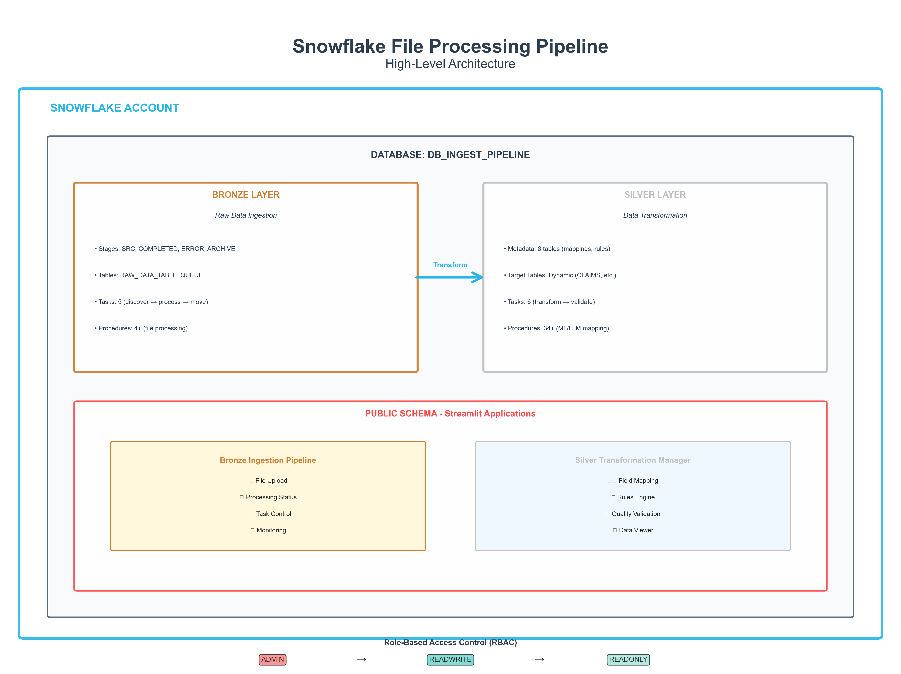
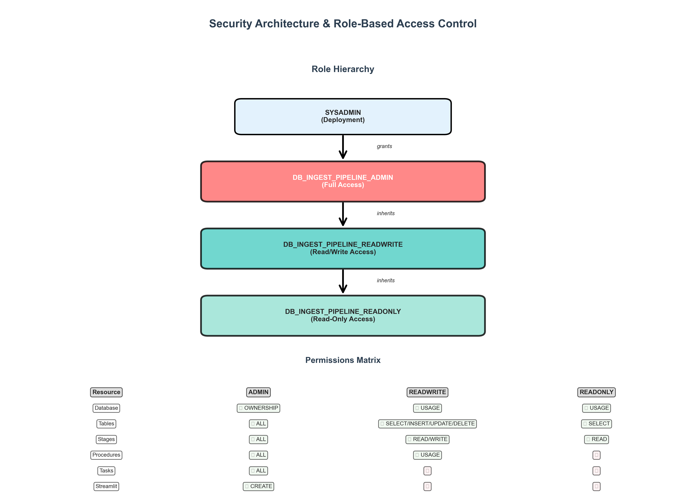
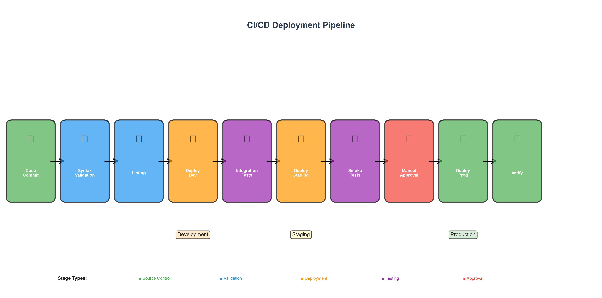

# System Architecture

## Overview

The Snowflake File Processing Pipeline is a production-ready data pipeline built entirely on Snowflake native features, implementing a medallion architecture (Bronze → Silver → Gold) for data processing and transformation.

## Quick Links

- **[High-Level Design](SYSTEM_DESIGN.md)** - Executive overview with diagrams
- **[Technical Specification](TECHNICAL_SPECIFICATION.md)** - Detailed technical reference
- **[Deployment Guide](DEPLOYMENT_GUIDE.md)** - Operations and deployment procedures
- **[Visual Diagrams](images/)** - All architecture diagrams

---

## Architecture Principles

### 1. Cloud-Native Design
- **100% Snowflake**: No external orchestration tools required
- **Serverless**: Leverages Snowflake's compute and storage separation
- **Scalable**: Automatically scales with data volume

### 2. Medallion Architecture
- **Bronze Layer**: Raw data ingestion and storage
- **Silver Layer**: Cleaned, transformed, and standardized data
- **Gold Layer**: Business-ready aggregated data (future)

### 3. Security First
- **RBAC**: Three-tier role hierarchy (ADMIN, READWRITE, READONLY)
- **Principle of Least Privilege**: Each role has minimal required permissions
- **Audit Trail**: Complete tracking of all operations

---

## High-Level Architecture



*Figure 1: Snowflake File Processing Pipeline - High-Level Architecture*

---

## Bronze Layer Architecture

### Visual Overview


*Figure 2: Bronze Layer - Raw Data Ingestion*

### ASCII Diagram

```
┌─────────────────────────────────────────────────────────────┐
│                      BRONZE LAYER                            │
│                   (Raw Data Ingestion)                       │
├─────────────────────────────────────────────────────────────┤
│                                                               │
│  ┌──────────────┐  ┌──────────────┐  ┌──────────────┐      │
│  │   @SRC       │  │  @COMPLETED  │  │    @ERROR    │      │
│  │  (Landing)   │  │  (Success)   │  │  (Failed)    │      │
│  └──────┬───────┘  └──────────────┘  └──────────────┘      │
│         │                                                     │
│         ↓                                                     │
│  ┌────────────────────────────────────────────────┐         │
│  │         TASK PIPELINE                          │         │
│  │  1. discover_files_task (60 min)              │         │
│  │  2. process_files_task (on trigger)           │         │
│  │  3. move_successful_files_task (parallel)     │         │
│  │  4. move_failed_files_task (parallel)         │         │
│  │  5. archive_old_files_task (daily)            │         │
│  └────────────────────────────────────────────────┘         │
│         │                                                     │
│         ↓                                                     │
│  ┌────────────────┐  ┌────────────────────────┐            │
│  │ RAW_DATA_TABLE │  │file_processing_queue   │            │
│  │  (VARIANT)     │  │  (Status Tracking)     │            │
│  └────────────────┘  └────────────────────────┘            │
│                                                               │
└─────────────────────────────────────────────────────────────┘
```

### Key Components

**Stages (6)**
1. `@SRC` - Landing zone for incoming files
2. `@COMPLETED` - Successfully processed files (30-day retention)
3. `@ERROR` - Failed files for review (30-day retention)
4. `@ARCHIVE` - Long-term archive (files > 30 days)
5. `@STREAMLIT_STAGE` - Streamlit application files
6. `@CONFIG_STAGE` - Configuration files

**Tables (2)**
1. `RAW_DATA_TABLE` - Stores ingested data as VARIANT with metadata
2. `file_processing_queue` - Tracks file processing status

**Stored Procedures (4)**
1. `process_single_csv_file()` - Python procedure for CSV parsing
2. `process_single_excel_file()` - Python procedure for Excel parsing
3. `discover_files()` - SQL procedure for file discovery
4. `process_queued_files()` - SQL procedure for orchestration

**Tasks (5)**
1. `discover_files_task` - Scans @SRC every 60 minutes (configurable)
2. `process_files_task` - Processes queued files (triggered by discovery)
3. `move_successful_files_task` - Moves SUCCESS files to @COMPLETED
4. `move_failed_files_task` - Moves FAILED files to @ERROR
5. `archive_old_files_task` - Archives files > 30 days (daily at 2 AM)

---

## Silver Layer Architecture

### Visual Overview


*Figure 3: Silver Layer - Clean & Standardized Data*

### ASCII Diagram

```
┌─────────────────────────────────────────────────────────────┐
│                      SILVER LAYER                            │
│              (Clean & Standardized Data)                     │
├─────────────────────────────────────────────────────────────┤
│                                                               │
│  ┌─────────────────────────────────────────────┐            │
│  │         METADATA TABLES                     │            │
│  │  • target_schemas (table definitions)      │            │
│  │  • field_mappings (Bronze → Silver)        │            │
│  │  • transformation_rules (quality/logic)    │            │
│  │  • silver_processing_log (audit trail)     │            │
│  │  • data_quality_metrics (monitoring)       │            │
│  └─────────────────────────────────────────────┘            │
│                      │                                        │
│                      ↓                                        │
│  ┌─────────────────────────────────────────────┐            │
│  │     FIELD MAPPING ENGINE                    │            │
│  │  ┌──────────┬──────────┬──────────┐        │            │
│  │  │  Manual  │    ML    │   LLM    │        │            │
│  │  │   CSV    │ Pattern  │ Cortex   │        │            │
│  │  │ Mappings │ Matching │   AI     │        │            │
│  │  └──────────┴──────────┴──────────┘        │            │
│  └─────────────────────────────────────────────┘            │
│                      │                                        │
│                      ↓                                        │
│  ┌─────────────────────────────────────────────┐            │
│  │         RULES ENGINE                        │            │
│  │  ┌──────────┬──────────┬──────────┐        │            │
│  │  │   Data   │ Business │Standard  │        │            │
│  │  │ Quality  │  Logic   │  Format  │        │            │
│  │  └──────────┴──────────┴──────────┘        │            │
│  │  ┌──────────┐                               │            │
│  │  │  Dedupe  │                               │            │
│  │  └──────────┘                               │            │
│  └─────────────────────────────────────────────┘            │
│                      │                                        │
│                      ↓                                        │
│  ┌─────────────────────────────────────────────┐            │
│  │      SILVER TARGET TABLES                   │            │
│  │  (Dynamically created from metadata)        │            │
│  └─────────────────────────────────────────────┘            │
│                                                               │
└─────────────────────────────────────────────────────────────┘
```

### Key Components

**Stages (3)**
1. `@SILVER_STAGE` - Intermediate transformation files
2. `@SILVER_CONFIG` - Mapping and rules CSV files
3. `@SILVER_STREAMLIT` - Silver Streamlit application

**Metadata Tables (7)**
1. `target_schemas` - Dynamic target table definitions
2. `field_mappings` - Bronze → Silver field mappings
3. `transformation_rules` - Data quality and business rules
4. `silver_processing_log` - Transformation batch audit trail
5. `data_quality_metrics` - Quality tracking
6. `quarantine_records` - Failed validation records
7. `processing_watermarks` - Incremental processing state

**Stored Procedures (15+)**
- Schema management (create tables, discover schemas)
- Field mapping (manual, ML, LLM)
- Rules engine (quality, business, standardization, deduplication)
- Transformation orchestration
- Task management

**Tasks (6)**
1. `bronze_completion_sensor` - Monitors Bronze layer completion
2. `silver_discovery_task` - Discovers new Bronze data
3. `silver_transformation_task` - Transforms Bronze → Silver
4. `silver_quality_check_task` - Validates data quality
5. `silver_publish_task` - Publishes to Silver tables
6. `silver_quarantine_task` - Handles failed records

---

## Data Flow

### End-to-End Processing


*Figure 4: End-to-End Data Flow*

```
1. FILE UPLOAD
   ├─ Via Streamlit UI (drag & drop)
   ├─ Via Snowflake CLI (PUT command)
   └─ Via External ETL (COPY INTO)
           │
           ↓
2. BRONZE INGESTION
   ├─ discover_files_task scans @SRC
   ├─ Files queued in file_processing_queue
   ├─ process_files_task parses files
   ├─ Data stored as VARIANT in RAW_DATA_TABLE
   └─ Files moved to @COMPLETED or @ERROR
           │
           ↓
3. SILVER TRANSFORMATION
   ├─ bronze_completion_sensor triggers
   ├─ silver_discovery_task identifies new data
   ├─ Field mapping applied (Manual/ML/LLM)
   ├─ Rules engine validates and transforms
   ├─ Data merged into Silver target tables
   └─ Quality metrics recorded
           │
           ↓
4. GOLD AGGREGATION (Future)
   ├─ Business metrics calculated
   ├─ Aggregations created
   └─ Analytics-ready views published
```

### Task Dependencies

#### Bronze Layer
```
discover_files_task (root task, scheduled)
    ↓
process_files_task (triggered by discovery)
    ├─→ move_successful_files_task (parallel)
    └─→ move_failed_files_task (parallel)

archive_old_files_task (independent, daily)
```

#### Silver Layer
```
bronze_completion_sensor (monitors Bronze)
    ↓
silver_discovery_task (finds new data)
    ↓
silver_transformation_task (applies mappings & rules)
    ├─→ silver_quality_check_task (validates)
    └─→ silver_quarantine_task (handles failures)
    ↓
silver_publish_task (publishes to Silver)
```

---

## Security Architecture

### Visual Overview



*Figure 5: Security Architecture and Role-Based Access Control*

### Role Hierarchy

```
┌─────────────────────────────────────────┐
│         {DATABASE}_ADMIN                │
│  • Full control over database           │
│  • Can create/modify all objects        │
│  • Can grant permissions                │
│  • Can manage tasks                     │
└──────────────┬──────────────────────────┘
               │
               ↓
┌─────────────────────────────────────────┐
│       {DATABASE}_READWRITE              │
│  • Read/write access to tables          │
│  • Can execute stored procedures        │
│  • Can upload files to stages           │
│  • Can use Streamlit apps               │
└──────────────┬──────────────────────────┘
               │
               ↓
┌─────────────────────────────────────────┐
│        {DATABASE}_READONLY              │
│  • Read-only access to tables           │
│  • Can view stages                      │
│  • Can use Streamlit apps (read-only)   │
│  • Cannot modify data                   │
└─────────────────────────────────────────┘
```

### Permission Model

**ADMIN Role**
- All READWRITE permissions
- CREATE/ALTER/DROP objects
- GRANT/REVOKE permissions
- EXECUTE/RESUME/SUSPEND tasks
- Future grants on new objects

**READWRITE Role**
- SELECT/INSERT/UPDATE/DELETE on tables
- READ/WRITE on stages
- EXECUTE on stored procedures
- USAGE on Streamlit apps
- Future grants on new tables

**READONLY Role**
- SELECT on tables
- READ on stages
- USAGE on Streamlit apps
- Future grants on new tables (SELECT only)

---

## Deployment Architecture



*Figure 6: CI/CD Deployment Pipeline*

### Deployment Components

**Scripts**
- `deploy.sh` - Master deployment script
- `deploy_bronze.sh` - Bronze layer deployment
- `deploy_silver.sh` - Silver layer deployment
- `undeploy.sh` - Complete teardown

**Configuration**
- `default.config` - Default settings
- `custom.config` - User overrides
- Environment detection (macOS, Linux, Windows)

**Platform Support**
- macOS (native bash)
- Linux (native bash)
- Windows (Git Bash, WSL, Cygwin)

---

## Scalability Considerations

### Compute Scaling
- **Warehouse Size**: Configurable per task
- **Auto-suspend**: Warehouses suspend when idle
- **Auto-resume**: Warehouses resume on demand
- **Parallel Processing**: Tasks run in parallel where possible

### Storage Scaling
- **Automatic**: Snowflake handles storage scaling
- **Compression**: Automatic data compression
- **Partitioning**: Time-based partitioning for large tables
- **Clustering**: Optional clustering keys for performance

### Task Scheduling
- **Configurable Frequency**: Discovery task runs every N minutes (default 60)
- **Event-Driven**: Processing tasks triggered by predecessors
- **Parallel Execution**: Multiple tasks can run simultaneously
- **Error Handling**: Failed tasks don't block others

---

## Monitoring & Observability

### Built-in Monitoring

**Streamlit Applications**
- Bronze App: File upload, status monitoring, task management
- Silver App: Schema design, mapping, rules, quality metrics

**Snowflake Native**
- Task history (TASK_HISTORY view)
- Query history (QUERY_HISTORY view)
- Storage metrics (STORAGE_USAGE view)
- Warehouse usage (WAREHOUSE_METERING_HISTORY view)

### Audit Trail

**Bronze Layer**
- `file_processing_queue` - Complete file processing history
- Task execution logs
- Stage file listings with timestamps

**Silver Layer**
- `silver_processing_log` - Transformation batch history
- `data_quality_metrics` - Quality measurements over time
- `quarantine_records` - Failed validation records
- `processing_watermarks` - Incremental processing state

---

## Performance Optimization

### Best Practices

1. **Batch Processing**
   - Process files in configurable batches
   - Use MERGE for upserts (better than INSERT/UPDATE)
   - Leverage Snowflake's micro-partitions

2. **Query Optimization**
   - Use VARIANT efficiently (extract only needed fields)
   - Create views for common queries
   - Use clustering keys for large tables

3. **Task Optimization**
   - Right-size warehouses for each task
   - Use task dependencies to minimize idle time
   - Enable parallel execution where possible

4. **Storage Optimization**
   - Archive old files to reduce stage size
   - Use time-travel for recovery (not long-term storage)
   - Implement data retention policies

---

## Disaster Recovery

### Backup Strategy

**Snowflake Native**
- Time Travel: 1-90 days (configurable)
- Fail-safe: 7 days after Time Travel
- Replication: Cross-region replication (optional)

**Application Level**
- Configuration files in version control
- Metadata tables backed up regularly
- SQL scripts in git repository

### Recovery Procedures

1. **File Loss**: Re-upload from source or restore from archive
2. **Table Corruption**: Use Time Travel to restore
3. **Configuration Loss**: Redeploy from git repository
4. **Complete Failure**: Run `undeploy.sh` then `deploy.sh`

---

## Technology Stack

### Core Technologies
- **Platform**: Snowflake (Native)
- **Language**: SQL, Python 3.11+
- **Framework**: Snowpark Python
- **UI**: Streamlit 1.51.0+
- **CLI**: Snowflake CLI (`snow`)

### Python Libraries
- `snowflake-snowpark-python` - Snowpark API
- `pandas` - Data manipulation
- `openpyxl` - Excel file handling
- `scikit-learn` - ML pattern matching (Silver)

### Deployment
- Shell scripts (`bash`)
- Configuration files (`.config`)
- YAML (Python environments, Snowflake CLI)

---

## Future Enhancements

### Gold Layer (Planned)
- Business-ready aggregations
- Dimensional modeling
- Analytics-optimized views
- Machine learning features

### Additional Features
- Real-time streaming ingestion
- Change data capture (CDC)
- Data lineage tracking
- Advanced data quality rules
- Integration with external BI tools

---

## References

### Project Documentation
- [System Design](SYSTEM_DESIGN.md) - High-level design overview
- [Technical Specification](TECHNICAL_SPECIFICATION.md) - Detailed technical reference
- [Deployment Guide](DEPLOYMENT_GUIDE.md) - Operations manual
- [User Guide](../USER_GUIDE.md) - End-user documentation
- [Documentation Index](../../DOCUMENTATION_INDEX.md) - All documentation

### Snowflake Documentation
- [Tasks](https://docs.snowflake.com/en/user-guide/tasks-intro)
- [Snowpark](https://docs.snowflake.com/en/developer-guide/snowpark/python/index)
- [Streamlit](https://docs.snowflake.com/en/developer-guide/streamlit/about-streamlit)
- [Stages](https://docs.snowflake.com/en/user-guide/data-load-local-file-system-create-stage)

### Design Patterns
- Medallion Architecture (Bronze/Silver/Gold)
- Event-Driven Architecture (Task dependencies)
- Metadata-Driven Processing (Silver layer)
- Rules as Data (Transformation rules)

---

**Document Version**: 3.0  
**Last Updated**: January 14, 2026  
**Status**: ✅ Production Ready
