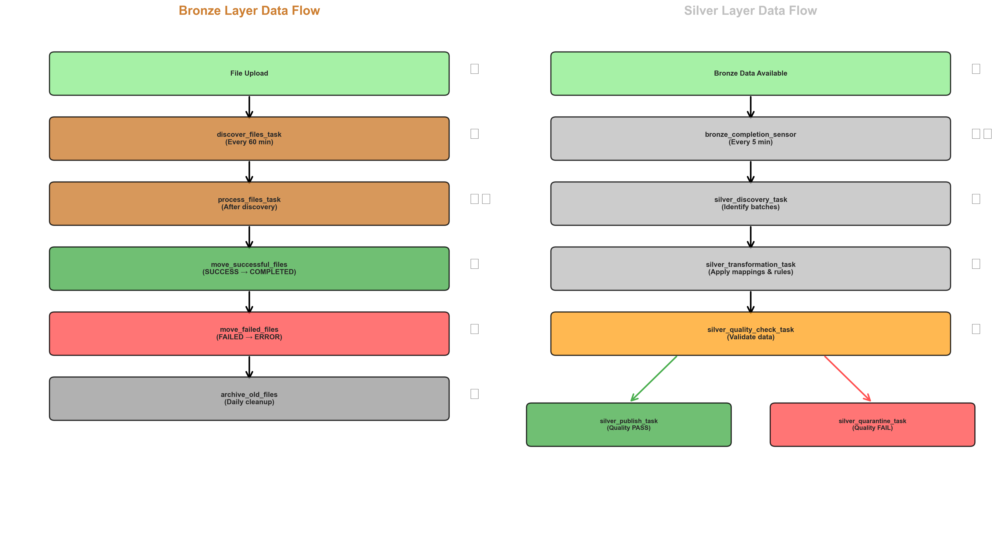

# System Design Document

## Snowflake File Processing Pipeline

**Version:** 1.0  
**Date:** January 2026  
**Status:** Production Ready

---

## Table of Contents

1. [Executive Summary](#executive-summary)
2. [System Overview](#system-overview)
3. [Architecture](#architecture)
4. [Component Design](#component-design)
5. [Data Flow](#data-flow)
6. [Security Design](#security-design)
7. [Scalability & Performance](#scalability--performance)
8. [Deployment Architecture](#deployment-architecture)
9. [Monitoring & Observability](#monitoring--observability)
10. [Disaster Recovery](#disaster-recovery)

---

## Executive Summary

The Snowflake File Processing Pipeline is a fully serverless, cloud-native data ingestion and transformation system built entirely on Snowflake's native features. It eliminates the need for external orchestration tools while providing enterprise-grade data processing capabilities.

### Key Design Principles

1. **100% Snowflake Native** - No external dependencies or orchestration tools
2. **Serverless Architecture** - Automatic scaling with zero infrastructure management
3. **Event-Driven Processing** - Task-based automation with dependency management
4. **Security by Design** - Role-based access control and encryption at rest
5. **Cost Optimization** - Pay-per-use model with automatic suspension
6. **Self-Service** - Streamlit UIs for non-technical users

---

## System Overview

### Purpose

Automate the ingestion, validation, transformation, and standardization of heterogeneous data files (CSV, Excel) into a unified, analytics-ready data warehouse.

### Scope

- **Bronze Layer**: Raw data ingestion with file discovery, processing, and archival
- **Silver Layer**: Data transformation with intelligent field mapping and quality rules
- **Streamlit Apps**: Web-based monitoring and management interfaces

### Technology Stack

| Component | Technology | Version |
|-----------|-----------|---------|
| Database | Snowflake | Current |
| Orchestration | Snowflake Tasks | Native |
| Processing | Python Stored Procedures | 3.11 |
| UI | Streamlit in Snowflake | Native |
| Deployment | Bash + Snowflake CLI | Latest |
| Version Control | Git | Any |

---

## Architecture

### High-Level Architecture


*Figure 1: Snowflake File Processing Pipeline - High-Level Architecture*

#### Architecture Details

```
┌─────────────────────────────────────────────────────────────┐
│                    SNOWFLAKE ACCOUNT                         │
│                                                              │
│  ┌────────────────────────────────────────────────────┐    │
│  │              DATABASE: DB_INGEST_PIPELINE           │    │
│  │                                                      │    │
│  │  ┌──────────────────────────────────────────────┐  │    │
│  │  │         BRONZE LAYER (Schema: BRONZE)        │  │    │
│  │  │                                               │  │    │
│  │  │  Stages:                                      │  │    │
│  │  │  • SRC (Source Files)                         │  │    │
│  │  │  • COMPLETED (Processed)                      │  │    │
│  │  │  • ERROR (Failed)                             │  │    │
│  │  │  • ARCHIVE (Long-term)                        │  │    │
│  │  │                                               │  │    │
│  │  │  Tables:                                      │  │    │
│  │  │  • RAW_DATA_TABLE (Variant JSON)             │  │    │
│  │  │  • FILE_PROCESSING_QUEUE (Metadata)          │  │    │
│  │  │                                               │  │    │
│  │  │  Tasks (5):                                   │  │    │
│  │  │  discover → process → move → archive         │  │    │
│  │  │                                               │  │    │
│  │  │  Procedures (4+):                             │  │    │
│  │  │  • discover_files()                           │  │    │
│  │  │  • process_queued_files()                     │  │    │
│  │  │  • move_files_to_stage()                      │  │    │
│  │  │  • archive_old_files()                        │  │    │
│  │  └──────────────────────────────────────────────┘  │    │
│  │                                                      │    │
│  │  ┌──────────────────────────────────────────────┐  │    │
│  │  │         SILVER LAYER (Schema: SILVER)        │  │    │
│  │  │                                               │  │    │
│  │  │  Metadata Tables (8):                         │  │    │
│  │  │  • target_schemas                             │  │    │
│  │  │  • field_mappings                             │  │    │
│  │  │  • transformation_rules                       │  │    │
│  │  │  • data_quality_metrics                       │  │    │
│  │  │  • processing_watermarks                      │  │    │
│  │  │  • quarantine_records                         │  │    │
│  │  │  • silver_processing_log                      │  │    │
│  │  │  • llm_mapping_cache                          │  │    │
│  │  │                                               │  │    │
│  │  │  Target Tables (Dynamic):                     │  │    │
│  │  │  • CLAIMS (example)                           │  │    │
│  │  │  • Others as defined                          │  │    │
│  │  │                                               │  │    │
│  │  │  Tasks (6):                                   │  │    │
│  │  │  sensor → discover → transform →              │  │    │
│  │  │  quality → publish/quarantine                 │  │    │
│  │  │                                               │  │    │
│  │  │  Procedures (34+):                            │  │    │
│  │  │  • Field Mapping (Manual/ML/LLM)             │  │    │
│  │  │  • Rules Engine                               │  │    │
│  │  │  • Transformation Logic                       │  │    │
│  │  │  • Quality Validation                         │  │    │
│  │  └──────────────────────────────────────────────┘  │    │
│  │                                                      │    │
│  │  ┌──────────────────────────────────────────────┐  │    │
│  │  │         PUBLIC SCHEMA (Shared)               │  │    │
│  │  │                                               │  │    │
│  │  │  Stages:                                      │  │    │
│  │  │  • STREAMLIT_STAGE (Bronze App)              │  │    │
│  │  │  • SILVER_STREAMLIT (Silver App)             │  │    │
│  │  │  • CONFIG_STAGE (Configuration)              │  │    │
│  │  │                                               │  │    │
│  │  │  Streamlit Apps (2):                          │  │    │
│  │  │  • BRONZE_INGESTION_PIPELINE                 │  │    │
│  │  │  • SILVER_TRANSFORMATION_MANAGER             │  │    │
│  │  └──────────────────────────────────────────────┘  │    │
│  └────────────────────────────────────────────────────┘    │
│                                                              │
│  ┌────────────────────────────────────────────────────┐    │
│  │              ROLE-BASED ACCESS CONTROL             │    │
│  │                                                      │    │
│  │  DB_INGEST_PIPELINE_ADMIN (Full Access)            │    │
│  │         ↓ inherits                                  │    │
│  │  DB_INGEST_PIPELINE_READWRITE (Read/Write)         │    │
│  │         ↓ inherits                                  │    │
│  │  DB_INGEST_PIPELINE_READONLY (Read Only)           │    │
│  └────────────────────────────────────────────────────┘    │
└─────────────────────────────────────────────────────────────┘
```

### Architectural Patterns

1. **Medallion Architecture** - Bronze (raw) → Silver (refined) → Gold (analytics-ready)
2. **Event-Driven Processing** - Task-based automation with dependencies
3. **Metadata-Driven Transformation** - Configuration tables drive processing logic
4. **Schema-on-Read** - Flexible VARIANT storage in Bronze, structured in Silver
5. **Idempotent Operations** - MERGE statements prevent duplicates

---

## Component Design

### Bronze Layer Components

#### 1. File Discovery System

**Purpose**: Automatically detect new files in source stage

**Design**:
- Scheduled task runs every N minutes (configurable)
- Compares stage contents with processing queue
- Inserts new files with PENDING status
- Supports CSV and Excel formats

**Key Procedure**: `discover_files()`

```sql
CREATE OR REPLACE PROCEDURE discover_files()
RETURNS VARCHAR
LANGUAGE PYTHON
```

**Logic**:
1. List all files in @SRC stage
2. Query existing files in FILE_PROCESSING_QUEUE
3. Identify new files (not in queue)
4. Insert new files with metadata (size, timestamp, format)
5. Return count of discovered files

#### 2. File Processing Engine

**Purpose**: Process queued files and load into RAW_DATA_TABLE

**Design**:
- Processes files in PENDING status
- Handles CSV and Excel formats
- Stores data as VARIANT (JSON-like)
- Updates queue status (SUCCESS/FAILED)
- Captures error messages

**Key Procedure**: `process_queued_files()`

**Logic**:
1. Select PENDING files (limit batch size)
2. For each file:
   - Detect format (CSV/Excel)
   - Load into temp table
   - Transform to VARIANT
   - MERGE into RAW_DATA_TABLE (deduplication)
   - Update queue status
3. Handle errors gracefully

#### 3. File Movement System

**Purpose**: Move processed files to appropriate stages

**Design**:
- Separate tasks for SUCCESS and FAILED files
- Moves files between stages using COPY FILES
- Updates queue with new location
- Maintains audit trail

**Key Procedure**: `move_files_to_stage()`

**Parameters**:
- `source_stage`: Source location
- `target_stage`: Destination location
- `status_filter`: File status to move

#### 4. Archival System

**Purpose**: Long-term storage of old files

**Design**:
- Runs daily
- Moves files older than N days (configurable)
- Compresses for storage efficiency
- Updates queue metadata

**Key Procedure**: `archive_old_files()`

**Logic**:
1. Identify files in COMPLETED stage older than threshold
2. Copy to ARCHIVE stage
3. Remove from COMPLETED stage
4. Update queue with archive location

### Silver Layer Components

#### 1. Field Mapping Engine

**Purpose**: Map source fields to target schema

**Design**: Three mapping methods

**A. Manual Mapping**
- User-defined mappings in CSV
- Loaded into `field_mappings` table
- 100% confidence score
- Pre-approved

**B. ML Pattern Matching**
- Fuzzy string matching algorithms
- Exact match, substring, TF-IDF similarity
- Confidence scores (0.0-1.0)
- Requires approval threshold

**C. LLM Semantic Mapping**
- Snowflake Cortex AI integration
- Semantic understanding of field names
- Context-aware suggestions
- Highest accuracy for ambiguous cases

**Key Procedures**:
- `suggest_field_mappings_manual()`
- `suggest_field_mappings_ml()`
- `suggest_field_mappings_llm()`

#### 2. Rules Engine

**Purpose**: Apply data quality and transformation rules

**Design**: Rule types

**A. Data Quality Rules**
- NOT_NULL: Field must have value
- FORMAT: Regex pattern matching
- RANGE: Numeric bounds checking
- REFERENTIAL: Foreign key validation

**B. Business Logic Rules**
- CALCULATION: Derived fields
- LOOKUP: Reference data joins
- CONDITIONAL: If-then transformations

**C. Standardization Rules**
- DATE_NORMALIZE: Consistent date formats
- NAME_CASE: Proper capitalization
- CODE_MAPPING: Value standardization

**Key Procedures**:
- `apply_quality_rules()`
- `apply_transformation_rules()`
- `validate_batch()`

#### 3. Transformation Engine

**Purpose**: Transform Bronze data to Silver tables

**Design**:
- Batch-based processing
- Watermark tracking for incremental loads
- Parallel processing support
- Error quarantine

**Key Procedure**: `transform_bronze_to_silver()`

**Logic**:
1. Identify new Bronze records (watermark)
2. Load approved field mappings
3. Apply transformation rules
4. Validate data quality
5. Insert into target Silver tables
6. Update watermark
7. Log processing metrics

#### 4. Quality Validation System

**Purpose**: Ensure data quality before publishing

**Design**:
- Configurable quality metrics
- Pass/fail thresholds
- Quarantine for failed records
- Detailed error logging

**Key Procedure**: `validate_silver_data()`

**Metrics**:
- Completeness: % non-null values
- Accuracy: % passing validation rules
- Consistency: % matching expected patterns
- Timeliness: Processing lag

---

## Data Flow



*Figure 2: Bronze and Silver Layer Data Flow*

### Bronze Layer Flow

```
1. File Upload
   ↓
2. discover_files_task (Every 60 min)
   - Scans @SRC stage
   - Adds to FILE_PROCESSING_QUEUE
   ↓
3. process_files_task (After discovery)
   - Reads files from queue
   - Loads into RAW_DATA_TABLE
   - Updates queue status
   ↓
4. move_successful_files_task (After processing)
   - Moves SUCCESS files to @COMPLETED
   ↓
5. move_failed_files_task (After processing)
   - Moves FAILED files to @ERROR
   ↓
6. archive_old_files_task (Daily)
   - Moves old files to @ARCHIVE
```

### Silver Layer Flow

```
1. Bronze Data Available
   ↓
2. bronze_completion_sensor (Every 5 min)
   - Checks for new Bronze data
   ↓
3. silver_discovery_task (After sensor)
   - Identifies batches to process
   ↓
4. silver_transformation_task (After discovery)
   - Applies field mappings
   - Applies transformation rules
   - Loads into Silver tables
   ↓
5. silver_quality_check_task (After transformation)
   - Validates data quality
   ↓
6a. silver_publish_task (If quality pass)
    - Marks data as published
    ↓
6b. silver_quarantine_task (If quality fail)
    - Moves to quarantine
    - Logs errors
```

---

## Security Design


*Figure 3: Security Architecture and Role-Based Access Control*

### Authentication & Authorization

**Role Hierarchy**:
```
SYSADMIN (Deployment)
    ↓
DB_INGEST_PIPELINE_ADMIN (Full Access)
    ↓ grants
DB_INGEST_PIPELINE_READWRITE (Read/Write)
    ↓ grants
DB_INGEST_PIPELINE_READONLY (Read Only)
```

**Permissions Matrix**:

| Resource | ADMIN | READWRITE | READONLY |
|----------|-------|-----------|----------|
| Database | OWNERSHIP | USAGE | USAGE |
| Schemas | OWNERSHIP | USAGE | USAGE |
| Tables | ALL | SELECT, INSERT, UPDATE, DELETE | SELECT |
| Stages | ALL | READ, WRITE | READ |
| Procedures | ALL | USAGE | - |
| Tasks | ALL | - | - |
| Streamlit | CREATE | - | - |

### Data Security

1. **Encryption at Rest**: Snowflake-managed encryption (SSE)
2. **Encryption in Transit**: TLS 1.2+
3. **Access Logging**: INFORMATION_SCHEMA.ACCESS_HISTORY
4. **Row-Level Security**: Can be added via policies
5. **Column-Level Security**: Can be added via masking policies

### Secrets Management

- No hardcoded credentials
- Snowflake CLI connection management
- Config files excluded from version control
- Environment-specific configurations

---

## Scalability & Performance

### Horizontal Scalability

**Bronze Layer**:
- Parallel file processing (batch size configurable)
- Multiple tasks can run concurrently
- Stage-based isolation prevents conflicts

**Silver Layer**:
- Batch-based processing
- Watermark tracking for incremental loads
- Parallel transformation of independent batches

### Vertical Scalability

**Warehouse Sizing**:
- Default: COMPUTE_WH (configurable)
- Auto-suspend after inactivity
- Auto-resume on demand
- Can scale up for large batches

### Performance Optimizations

1. **VARIANT Storage**: Efficient semi-structured data handling
2. **MERGE Operations**: Upsert pattern prevents duplicates
3. **Clustering Keys**: Can be added to large tables
4. **Materialized Views**: Can be added for common queries
5. **Result Caching**: Automatic query result caching

### Capacity Planning

**Bronze Layer**:
- Files/day: Unlimited (task-based processing)
- File size: Up to 5GB per file (Snowflake limit)
- Retention: 30 days in COMPLETED, indefinite in ARCHIVE

**Silver Layer**:
- Records/batch: 10,000 (configurable)
- Batches/day: Unlimited
- Target tables: Unlimited (metadata-driven)

---

## Deployment Architecture

### Deployment Model

**Infrastructure as Code**:
- SQL scripts for database objects
- Bash scripts for orchestration
- Configuration files for customization
- Version controlled in Git

**Deployment Layers**:
1. Database & Roles (1_Setup_Database_Roles.sql)
2. Bronze Schema (2_Bronze_Schema_Tables.sql)
3. Bronze Logic (3_Bronze_Setup_Logic.sql)
4. Bronze Tasks (4_Bronze_Tasks.sql)
5. Silver Schema (1_Silver_Schema_Setup.sql)
6. Silver Procedures (2-5_Silver_*.sql)
7. Silver Tasks (6_Silver_Tasks.sql)
8. Streamlit Apps (deploy_streamlit.sql)

### Environment Strategy

**Recommended Environments**:
- **Development**: dev_ingest_pipeline
- **Staging**: stg_ingest_pipeline
- **Production**: prod_ingest_pipeline

**Configuration Management**:
- `default.config`: Default values
- `dev.config`: Development overrides
- `prod.config`: Production overrides

### CI/CD Integration


*Figure 4: CI/CD Deployment Pipeline*

**Deployment Pipeline**:
```
1. Code Commit → Git
2. Syntax Validation → bash -n
3. Linting → shellcheck
4. Deploy to Dev → ./deploy.sh dev.config
5. Integration Tests → SQL test scripts
6. Deploy to Staging → ./deploy.sh stg.config
7. Smoke Tests → Verify deployment
8. Manual Approval → Required
9. Deploy to Production → ./deploy.sh prod.config
10. Verification → Post-deployment checks
```

---

## Monitoring & Observability

### Logging

**Bronze Layer**:
- FILE_PROCESSING_QUEUE: Processing status and errors
- Task history: INFORMATION_SCHEMA.TASK_HISTORY()

**Silver Layer**:
- silver_processing_log: Detailed transformation logs
- data_quality_metrics: Quality scores over time
- quarantine_records: Failed validations

### Metrics

**Key Performance Indicators**:
- Files processed per hour
- Processing success rate
- Average processing time
- Data quality scores
- Quarantine rate
- Storage utilization

### Alerting

**Recommended Alerts**:
- Task failures (3+ consecutive)
- Processing queue backlog (> 100 files)
- Quality score drops (< 90%)
- High quarantine rate (> 10%)
- Storage threshold (> 80%)

### Dashboards

**Streamlit Apps**:
- Bronze: File processing status, task history, stage contents
- Silver: Transformation metrics, quality scores, field mappings

**External Tools**:
- Snowsight: Query history, warehouse utilization
- Third-party: Grafana, Datadog (via Snowflake connector)

---

## Disaster Recovery

### Backup Strategy

**Snowflake Features**:
- Time Travel: 90 days (Enterprise Edition)
- Fail-safe: 7 days after Time Travel
- Cloning: Zero-copy clones for testing

**Backup Procedures**:
```sql
-- Create backup clone
CREATE DATABASE db_ingest_pipeline_backup
  CLONE db_ingest_pipeline;

-- Restore from backup
CREATE OR REPLACE DATABASE db_ingest_pipeline
  CLONE db_ingest_pipeline_backup;
```

### Recovery Procedures

**Scenario 1: Accidental Data Deletion**
```sql
-- Restore table from Time Travel
CREATE OR REPLACE TABLE raw_data_table
  CLONE raw_data_table AT (OFFSET => -3600); -- 1 hour ago
```

**Scenario 2: Failed Deployment**
```bash
# Rollback deployment
./undeploy.sh
./deploy.sh previous_version.config
```

**Scenario 3: Corrupted Data**
```sql
-- Identify corruption timestamp
-- Restore from before corruption
CREATE OR REPLACE TABLE silver_table
  CLONE silver_table AT (TIMESTAMP => '2026-01-14 10:00:00');
```

### Business Continuity

**RTO (Recovery Time Objective)**: < 1 hour
**RPO (Recovery Point Objective)**: < 5 minutes (task frequency)

**Continuity Measures**:
1. Multi-region Snowflake account (optional)
2. Automated backups (clones)
3. Documented recovery procedures
4. Regular DR testing (quarterly)

---

## Appendices

### A. Glossary

- **Bronze Layer**: Raw data ingestion layer
- **Silver Layer**: Refined, transformed data layer
- **Medallion Architecture**: Bronze → Silver → Gold pattern
- **VARIANT**: Snowflake semi-structured data type
- **Time Travel**: Snowflake feature for historical data access
- **Watermark**: Tracking mechanism for incremental processing

### B. References

- Snowflake Documentation: https://docs.snowflake.com/
- Snowflake Tasks: https://docs.snowflake.com/en/user-guide/tasks-intro
- Snowflake Cortex: https://docs.snowflake.com/en/user-guide/snowflake-cortex
- Streamlit in Snowflake: https://docs.snowflake.com/en/developer-guide/streamlit/about-streamlit

### C. Version History

| Version | Date | Author | Changes |
|---------|------|--------|---------|
| 1.0 | 2026-01-14 | System | Initial design document |

---

**Document Status**: APPROVED  
**Next Review**: 2026-04-14  
**Owner**: Data Engineering Team
